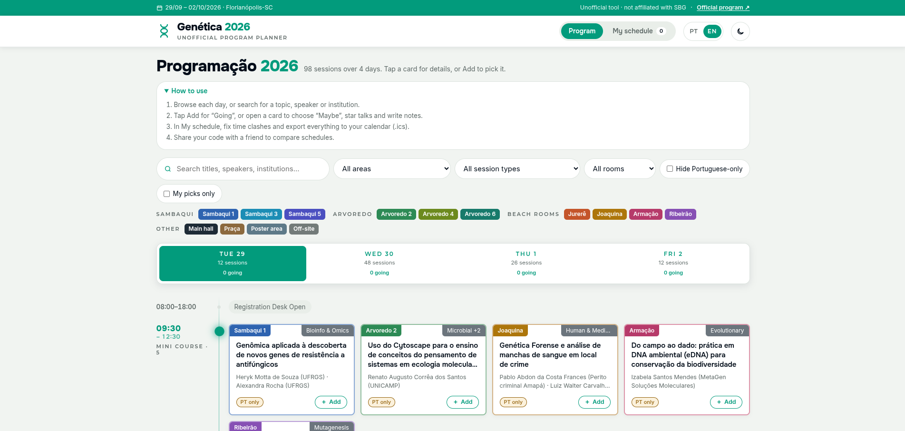
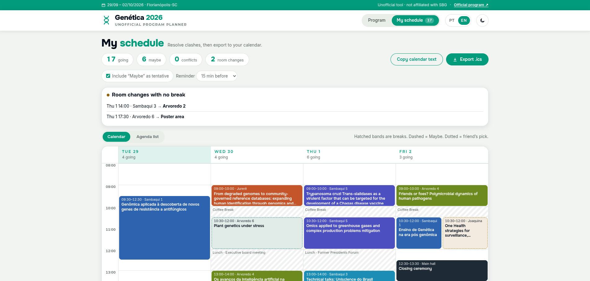

# Genética 2026 Planner

An unofficial, bilingual (PT/EN) web planner for **Genética 2026 – 71º Congresso Brasileiro de Genética** (Florianópolis, 29 Sep – 2 Oct 2026).

**Live site:** https://arielmmaia.github.io/genetica2026-planner/

## What it does

- Browse all 98 sessions by day, color-coded by room, with search and filters by area, session type and room
- Open any session to see its speakers, talks and chair, then mark it *Going* or *Maybe*
- Star individual talks inside symposia and write personal notes
- See your picks in a calendar view that flags time conflicts and room changes with no break
- Export your schedule to Google Calendar, Apple Calendar or Outlook (`.ics`)
- Compare schedules with a friend using a short share code
- Portuguese and English interface, plus light and dark themes

Everything runs in the browser. Picks and notes are saved only on the visitor's device, and nothing is sent to a server.

## How it was built

A single self-contained `index.html` (HTML, CSS and vanilla JavaScript, no frameworks or build step). The program was extracted from the official congress website and structured into sessions, rooms, thematic areas and speakers. Built with the assistance of Claude (Anthropic).

## Disclaimer

This is an independent project. It is not affiliated with or endorsed by the Sociedade Brasileira de Genética (SBG) or the congress organizers. The program was copied from the [official website](https://genetica2026.com.br/) on 29 September 2026 and may have changed since, so check the official program for final times and rooms. Program content belongs to its organizers and authors.

---

*Planejador não oficial da programação do Genética 2026: navegue pelas sessões, monte sua agenda, resolva conflitos de horário e exporte para o seu calendário.*

Made by Ariel Moura Maia · PUCRS, Porto Alegre
